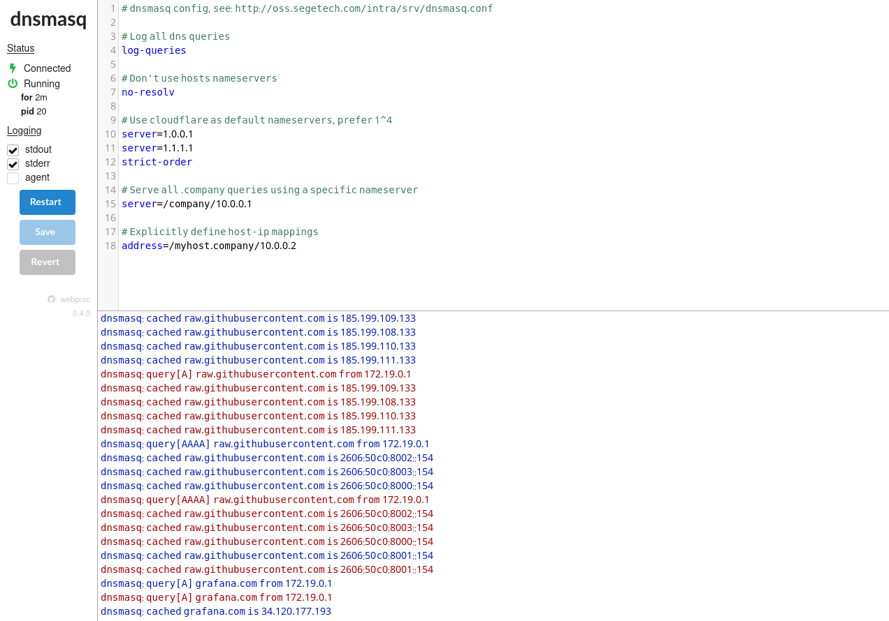

# Docker dnsmasq

[![Release version][badge_release_version]][link_releases]
[![Release][release_badge]][release_link]
[![License][badge_license]][link_license]
[![Image size][badge_size_latest]][link_docker_hub]

Deploy [dnsmasq](https://thekelleys.org.uk/dnsmasq/doc.html) with a simple web UI using Docker.



## How-to

Prepare your `dnsmasq.conf`

```conf
# Log all dns queries
log-queries

# Don't use hosts nameservers
no-resolv

# Use cloudflare as default nameservers
server=1.1.1.1
server=1.0.0.1
strict-order

# Serve all .company queries using a specific nameserver
server=/company/10.0.0.1

# Or explicitly define host-ip mappings
address=/myhost.company/10.0.0.2
address=/myhost2.company/10.0.0.3
```

## Run

```bash
docker compose up -d
```

## Usage

- Open <http://localhost:8080> to see web UI.
- If the port `53` is busy with other services like `systemd`, you should stop them.
- Use your Docker's host ip to set your DNS server on other devices in your network.
- You can use your `/etc/hosts` file as a Docker volume. dnsmasq will respect that.

---

## Support 💛

[](https://en.cryptobadges.io/donate/bc1qmmh6vt366yzjt3grjxjjqynrrxs3frun8gnxrz) [](https://en.cryptobadges.io/donate/0x0831bD72Ea8904B38Be9D6185Da2f930d6078094)

[](https://ko-fi.com/D1D1WGU9)

<div><a href="https://payping.ir/@hatamiarash7"></a></div>

## Contributing 🤝

Don't be shy and reach out to us if you want to contribute 😉

1. Fork it!
2. Create your feature branch: `git checkout -b my-new-feature`
3. Commit your changes: `git commit -am 'Add some feature'`
4. Push to the branch: `git push origin my-new-feature`
5. Submit a pull request

## Issues

Each project may have many problems. Contributing to the better development of this project by reporting them. 👍

[release_badge]: https://github.com/hatamiarash7/Docker-dnsmasq/actions/workflows/release.yml/badge.svg
[release_link]: https://github.com/hatamiarash7/Docker-dnsmasq/actions/workflows/release.yaml
[link_license]: https://github.com/hatamiarash7/Docker-dnsmasq/blob/master/LICENSE
[badge_license]: https://img.shields.io/github/license/hatamiarash7/docker-dnsmasq.svg?longCache=true
[badge_size_latest]: https://img.shields.io/docker/image-size/hatamiarash7/dnsmasq/latest?maxAge=30
[link_docker_hub]: https://hub.docker.com/r/hatamiarash7/dnsmasq/
[badge_release_version]: https://img.shields.io/github/release/hatamiarash7/docker-dnsmasq.svg?maxAge=30&label=Release
[link_releases]: https://github.com/hatamiarash7/Docker-dnsmasq/releases
